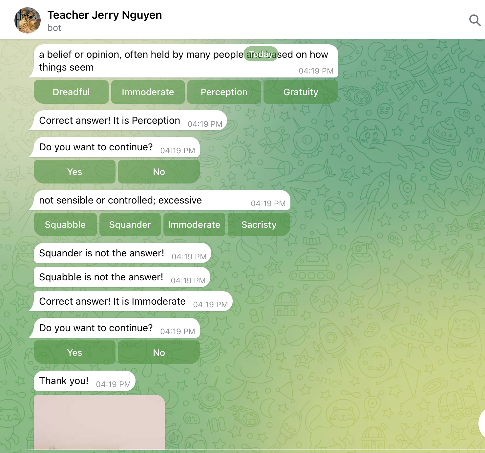

<h1 align="center">Teacher Jerry 😼</h1>

<div align="center">

Learning vocabulary with teacher Jerry as [Telegram Bot](https://core.telegram.org/bots/api).


[](https://core.telegram.org/bots/api)


</div>

## 📝 Introduction

Teacher Jerry as a Telegram Bot, I am built by [Telegram Bot API]((https://core.telegram.org/bots/api)) and deployed to [Cloudflare](https://dash.cloudflare.com/)



## 🥂 Command

You can type `/help` for the instructions.

## 💡 Features

1. Multiple choices vocabulary

<!-- ## 🛠 Configuration

1. Register Cloudflare account and Telegram Bot API

2. Set Telegram webhook by access this link: ```https://api.telegram.org/bot<YOUR BOT TOKEN>/setWebhook?url=<YOUR Cloudflare url>/webhooks/telegram```

3.  -->

